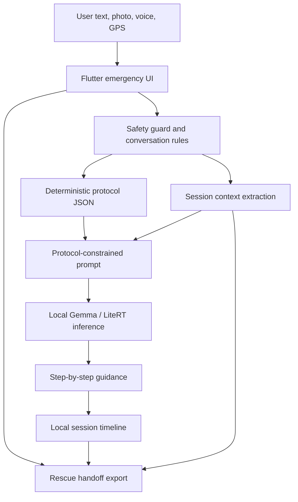

# AIDEM Kaggle Submission Draft

## Project Summary

AIDEM is an offline emergency triage assistant for no-signal environments. It combines deterministic first-aid and survival protocols with local Gemma reasoning, image-aware input, GPS/location handoff, and rescue-ready session exports.

Primary prize framing:

- Global Resilience
- Safety & Trust
- LiteRT / Edge AI
- Health & Sciences

One-sentence pitch:

> When someone is injured, offline, panicking, and alone, AIDEM turns messy situation reports into protocol-constrained actions and a clean rescue handoff.

## Problem

Remote and disaster emergencies often happen when cloud search, phone signal, and calm decision-making are unavailable. A generic chatbot is not enough in that setting. The user needs short, protocol-aware guidance that prioritizes immediate danger, asks one useful follow-up at a time, and preserves a timeline for rescuers.

AIDEM is not a diagnosis app and does not replace emergency services. It is local decision support for first aid, survival priorities, and rescue communication.

## Architecture

Key components:

- Flutter UI for emergency mode, practice mode, and judge demo scenarios.
- Local protocol JSON and knowledge-base references.
- Gemma running locally for language understanding, summarization, follow-up generation, and multilingual support.
- Safety guard that prevents repeated extraction JSON, repetitive questions, and unsafe fallback behavior.
- GPS/image/speech tools that enrich the local session without requiring cloud services.
- Rescue handoff export as Markdown.

## Where Gemma Is Used

Gemma is structurally important in AIDEM rather than decorative:

- Interprets messy natural-language situation reports.
- Extracts incident type, injury type, missing resources, hazards, and prior actions.
- Chooses relevant protocol context before answering.
- Asks one safety-critical follow-up question instead of free-form chatting.
- Summarizes the session into rescue handoff language.
- Supports multilingual interaction while preserving protocol constraints.
- Uses image input when available, while stating what cannot be inferred safely from the image.

The app also has deterministic fallback behavior so demo scenarios and safety-critical basics remain usable if the local model is unavailable during judging.

## Safety Design

AIDEM is designed as protocol-constrained emergency decision support:

- Emergency-service-first messaging appears in the active session.
- The UI labels protocol-based guidance, local data, and rescue-summary readiness.
- The assistant is instructed not to diagnose burn depth, venom risk, fracture severity, or hidden injury from images alone.
- The fallback path avoids unsafe advice such as induced vomiting, unsafe wound fluids, moving spinal injuries, or folk burn remedies.
- The response style is intentionally short: one next step and one targeted question.
- The export preserves a timeline rather than replacing professional handoff.

## Evaluation Evidence

Initial scenario eval file:

- `aidem_app/test/protocol_adherence_eval_test.dart`
- 9 scenarios currently covered.
- Categories include severe bleeding, back/neck injury, burns, poisoning, snake bite, lost/no signal, wound without clean water, cold exposure, and image burn path.
- Each case checks for expected safety behavior and forbidden unsafe phrases.

Current known limitation:

- The local Flutter tool is hanging in this workspace, so the focused test command could not complete yet.
- Intended command: `flutter test test/protocol_adherence_eval_test.dart`

## Judge Demo Instructions

Recommended demo path:

1. Install or open the AIDEM app.
2. From the home screen, use Demo Scenarios.
3. Start Lost hiker or Severe bleeding first; these work even when the model is unavailable.
4. Open the rescue-summary button in the session header.
5. Export the Markdown handoff file with the download button.
6. For image behavior, start Burn assessment or attach a burn/wound photo in an active session.

Expected device:

- Android phone or emulator capable of running the Flutter APK.
- Local Gemma model installed for full AI behavior.
- Demo scenarios still show the core safety system without a model.
- Packaged Android and Windows builds are available from the local release artifacts prepared for judging.

## Three-Minute Video Script

### 0:00-0:25 Problem

Show a no-signal outdoor emergency: a hiker is alone, injured, and cannot search online. The narration should say that panic and lack of connectivity make the first few minutes dangerous.

### 0:25-1:35 AIDEM In Action

Open AIDEM and tap the Lost hiker demo. Show that the app starts with protocol-based guidance, asks for the most important missing fact, and keeps the response short. Share location from the session controls, then show the context summary.

### 1:35-2:15 Rescue Handoff

Open Session Summary. Show the situation summary, dispatcher script, checklist, and timeline. Export the Markdown handoff.

### 2:15-2:40 Technical Credibility

Show the architecture slide or writeup diagram. Emphasize local Gemma, protocol JSON, local session timeline, image/GPS inputs, and offline-first privacy.

### 2:40-3:00 Impact

Close with the outcome: AIDEM helps the user stay calm, follow protocol, preserve critical details, and give rescuers a clear handoff when help becomes reachable.

## Remaining Submission Risks

- Capture an Android airplane-mode screenshot showing GPS active and AIDEM running offline.
- More eval scenarios would make the safety story stronger.
- The video should show one complete emotional workflow, not a tour of buttons.
