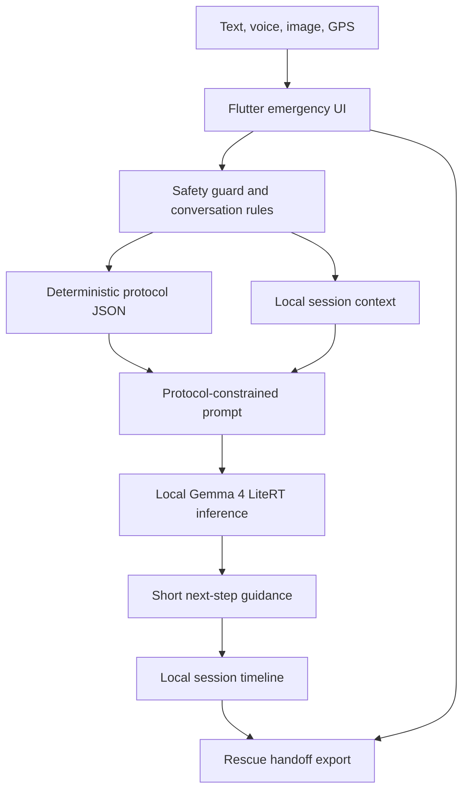

# AIDEM: Offline Emergency Guidance When Connection Is Not an Option

## Subtitle

A protocol-constrained emergency assistant powered by on-device Gemma 4, built for no-signal situations where cloud tools and phone calls may be unavailable.

## Track

Global Resilience

## Project Summary

AIDEM is an offline emergency guidance app for the moment when the tools people normally rely on disappear. In remote trails, storms, disasters, power outages, and other data-denied environments, a person may have no signal, no search engine, and no way to call for help immediately. AIDEM fills that gap with on-device AI, deterministic emergency protocols, local tools, and a rescue handoff that preserves what happened.

The app is not a doctor, diagnosis system, or replacement for emergency services. Its role is narrower and safer: help the user stay calm, follow short protocol-based steps, preserve battery and location, and keep a clear timeline until professional help becomes reachable.

## Why This Matters

Most AI assistance assumes connectivity. Most offline first-aid resources are static pages or PDFs. AIDEM combines the strengths of both: it works locally, but still lets the user describe a messy real-world situation in natural language. Instead of asking someone under stress to search through a manual, AIDEM can interpret what they say, ask one useful follow-up, and route the interaction through a protocol layer.

The main use case in the demo is an injured runner in the forest with no signal. She opens AIDEM, dictates what happened, receives short step-by-step guidance, captures location and visual context, and prepares a rescue summary for when she reaches signal or meets responders.

## Architecture

AIDEM is built in Flutter. Its core runtime combines:

- A deterministic protocol dataset for first-aid and resilience flows.
- A local Gemma 4 LiteRT model for language understanding and response generation.
- Safety prompts and guardrails that keep the model inside emergency decision-support boundaries.
- Local session state for timeline, symptoms, hazards, photos, GPS coordinates, and actions already taken.
- Speech input, text-to-speech, image input, emergency-number data, and rescue-summary export.

## How AIDEM Uses Gemma 4

Gemma is not used as a generic chatbot. It is used as the reasoning and language layer inside a constrained emergency workflow:

- It interprets natural, incomplete, or panicked user input.
- It extracts incident type, injury details, hazards, available resources, and missing critical facts.
- It helps ask one targeted follow-up question instead of opening a free-form chat.
- It adapts protocol guidance into calm, short, user-readable language.
- It summarizes the local session into a rescue handoff.
- It supports multilingual interaction while keeping the protocol logic stable.
- It can use image input as visible context while explicitly avoiding diagnosis from the photo alone.

The protocol layer remains responsible for safety boundaries. Gemma helps communicate, summarize, and adapt. It does not replace the app's deterministic emergency constraints.

## Safety And Trust Design

AIDEM is designed around three safety principles.

First, professional care comes first. The app repeatedly prioritizes calling emergency services via cellular, satellite, or radio whenever reachable.

Second, the app avoids diagnosis and overconfidence. It does not claim to determine fracture severity, burn depth, venom risk, hidden injury, or clinical status from text or images alone. When uncertainty matters, it says so and escalates toward professional care.

Third, guidance stays short and protocol-based. In emergencies, long explanations can increase panic. AIDEM focuses on the next safe step, immediate dangers, and the information rescuers will need.

The app also includes practical offline behavior: battery-saver reminders for long waits, GPS capture, local emergency-number data, hands-free dictation and playback, and a rescue summary that can be shown or shared later.

## Evaluation And Engineering Evidence

The repository includes focused tests for protocol adherence, data quality, conversation safety, context compaction, and demo scenarios. The protocol evaluation set covers scenarios such as severe bleeding, back or neck injury, burns, poisoning, snake bite, stroke signs, opioid overdose, carbon monoxide exposure, lost/no-signal situations, wounds without clean water, cold exposure, and image-assisted burn guidance.

These tests check for expected safety behaviors and forbidden unsafe advice, such as inducing vomiting, applying ice to burns, cutting snake bites, moving possible spinal injuries, or wandering randomly when lost.

The app also includes judge-friendly demo scenarios so reviewers can test the safety and handoff workflow even if a full local model setup is not available on their device.

## Challenges

The main challenge was making the app feel useful without becoming a free-form medical chatbot. AIDEM solves this with a hybrid architecture: Gemma handles language and adaptation, while deterministic protocols, UI labels, fallback behavior, and safety prompts constrain what the assistant can do.

Another challenge was offline usability. A person in a real emergency may be cold, injured, moving, or low on battery. That led to design choices such as short guidance, dictation, text-to-speech, image input, GPS capture, battery preservation prompts, and a handoff summary instead of a long chat transcript.

## Demo Instructions

Judges can test AIDEM by installing the Android APK or using the Windows portable build. The fastest demo path is:

1. Open AIDEM.
2. Accept the safety notice.
3. Use the Best Demo / practice scenario on the home screen.
4. Enter or dictate a no-signal injury report.
5. Review the short protocol guidance and follow-up question.
6. Capture location or image context if available.
7. Open the rescue summary to see the timeline and dispatcher-ready handoff.

Full Gemma behavior requires selecting a local `.litertlm` model file during setup. The app also includes demo/fallback behavior for judging the workflow without relying on cloud services.

## Links

- Video: TODO add public YouTube link
- Code repository: TODO add public GitHub/Kaggle repository link
- Live demo / build files: TODO add public release link or attach files to Kaggle

