# <p align="center">AIDEM 🛡️</p>
<p align="center"><b>Artificial Intelligence Disaster & Emergency Management.</b></p>
<p align="center"><i>"Aid Them" when the grid goes down.</i></p>

<p align="center">
  
</p>

<p align="center">
  
  
  
  
</p>

---

## 🌲 The Hook

Imagine you’re miles deep in the wilderness, or in the aftermath of a major natural disaster. The grid is down, your cell signal is at zero, and someone is injured. Panic starts to set in. In that moment, you don't need a search bar—you need an expert.

**AIDEM** is a field-manual-grade expert system that lives in your pocket. Powered by Google’s **Gemma** model running entirely on-device, it provides 100% offline, context-aware assistance. It doesn't just answer questions—it leads you through them.

<p align="center">
  
</p>

## ✨ Key Features

- **🧠 Offline-First Intelligence**: Using MediaPipe and Gemma, complex inference is performed on the edge. No data ever leaves your device. Total privacy, total reliability.
- **🏥 The Triage Engine**: A structured, deterministic layer that guides you from initial assessment to final action, prioritizing life-saving measures (like stopping major bleeding) first.
- **📚 Expert Knowledge Base**: Protocols are sourced from the **US Army FM 21-76**, **FEMA**, **NOAA**, and **Wilderness First Aid** standards.
- **🗣️ Hands-Free Assistance**: Integrated speech-to-text and text-to-speech support for hands-on emergency scenarios.
- **📱 Cross-Platform Performance**: Built with Flutter for smooth, high-fidelity experiences on both Windows and Android.

## 🏗️ Technical Architecture: The Hybrid Expert System

AIDEM bridges the gap between creative AI reasoning and deterministic medical safety.

```mermaid
graph TD
    A[User Input] --> B{Safety Check}
    B -- Emergency --> C[Triage Decision Tree]
    B -- Query --> D[Context Injection Service]
    
    C --> E[Protocol Node Selection]
    E --> D
    
    F[(Local Knowledge Base)] --> D
    D --> G[MediaPipe LLM Runtime]
    G --> H[Gemma-4-E2B-IT Inference]
    H --> I[Actionable Directive]
    I --> J[User]
```



### Core Technology Stack
*   **Framework**: [Flutter](https://flutter.dev/)
*   **LLM Runtime**: [MediaPipe LLM Inference API](https://developers.google.com/mediapipe/solutions/genai/llm_inference)
*   **Model**: **Gemma-4-E2B-IT** (Quantized LiteRT)
*   **State Management**: [Riverpod](https://riverpod.dev/)
*   **Persistence**: Shared Preferences & Local File System

## 🚀 Getting Started

### Prerequisites
*   **Windows**: Windows 10/11 (x64)
*   **Android**: Android 12+ (SDK 31+) with high-performance NPU/GPU support recommended.
*   **Flutter SDK**: 3.19.0 or higher.

### Installation
1.  **Clone the Repository**:
    ```bash
    git clone https://github.com/CosminSh/survival-aid-offline.git
    cd survival-aid-offline/survival_aid_app
    ```
2.  **Install Dependencies**:
    ```bash
    flutter pub get
    ```
3.  **Model Setup**:
    The app will automatically prompt you to download the **Gemma-4-E2B-IT** model on first launch. 
    Alternatively, you can manually place the `.litertlm` model file in the `Assets/Models/` directory.

4.  **Run the App**:
    ```bash
    flutter run -d windows # Or your android device
    ```

## 📖 Documentation
*   [The Pitch](PITCH.md) - Why AIDEM matters.
*   [Technical Deep Dive](TECHNICAL_PRESENTATION.md) - Architecture and Edge AI details.
*   [Roadmap](TODO.md) - Current progress and future features.

## ⚖️ License
Distributed under the MIT License. See `LICENSE` for more information.

---
<p align="center">
  <b>AIDEM: Stay Calm. Follow the Protocol. Save Lives.</b>
</p>
