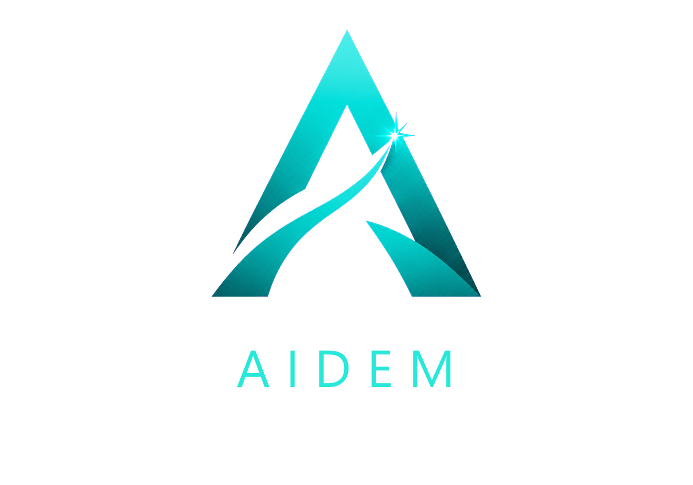
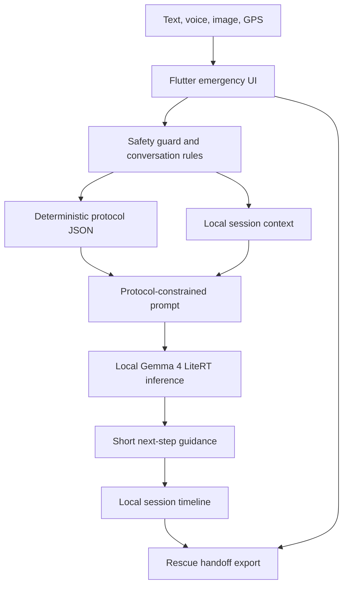

# AIDEM

<p align="center">
  
</p>

<p align="center"><b>Artificial Intelligence Disaster & Emergency Management</b></p>
<p align="center"><i>Offline emergency guidance when connection is not an option.</i></p>

<p align="center">
  
  
  
  
</p>

## Overview

AIDEM is an offline emergency assistant for no-signal environments. It combines on-device Gemma 4 reasoning with deterministic first-aid and resilience protocols, GPS/location capture, image and voice input, text-to-speech, local emergency-number data, and a rescue handoff summary.

The goal is not to replace emergency services or medical professionals. AIDEM is protocol-constrained decision support for the moments when the user cannot reach the cloud, cannot search, and may not be able to call for help immediately.

## Why It Exists

In remote trails, disasters, storms, power outages, and other data-denied situations, people still need calm guidance. Offline manuals are useful, but they are passive. AIDEM lets the user describe what happened in natural language, then keeps the response short, safety-aware, and tied to trusted protocols.

Core idea:

> When connection is gone and panic is rising, the person still has a safe next step.

## Key Features

- Fully offline emergency workflow after local model setup.
- Gemma 4 LiteRT on-device reasoning for language understanding, follow-up questions, summarization, and messy real-world input.
- Deterministic protocol layer for first-aid, survival, disaster, and rescue handoff flows.
- Practice/demo scenarios for judges and training.
- Voice dictation and text-to-speech for hands-busy situations.
- Image input treated as visible context, not diagnosis.
- GPS capture with decimal and DMS coordinates.
- Local emergency-number database.
- Rescue summary with timeline, symptoms, hazards, actions taken, and dispatcher-ready notes.
- Battery-preservation guidance for longer waits away from help.

## Architecture



## Technology Stack

- Flutter
- Riverpod
- Gemma 4 E2B IT LiteRT model
- `flutter_gemma`
- `geolocator`
- `speech_to_text`
- `flutter_tts`
- `image_picker`
- Local JSON protocol and knowledge-base assets

## Repository Layout

```text
aidem_app/                      Flutter app
aidem_app/lib/services/          Gemma, protocol, setup, guard, sound services
aidem_app/lib/providers/         Session and app state
aidem_app/assets/data/           Protocol, knowledge base, emergency numbers
aidem_app/assets/images/         App logo and generated platform assets
aidem_app/test/                  Protocol, data, guard, demo, and context tests
Docs/hackathon/                  Submission-ready writeups, demo guide, scripts
Docs/archive/                    Historical planning and draft notes
```

## Running The App

```bash
cd aidem_app
flutter pub get
flutter run -d windows
```

For Android:

```bash
cd aidem_app
flutter pub get
flutter run -d android
```

Validated hackathon demo targets are Android and Windows. Flutter project folders for iOS, macOS, Linux, and web are retained for future portability work, but they are not advertised as validated release targets in this submission.

Build commands:

```bash
cd aidem_app
flutter build apk --release
flutter build windows --release
```

## Model Setup

On first launch, AIDEM shows a model setup page. Select the recommended Gemma 4 LiteRT `.litertlm` file from local storage. After that, the app can use the model locally without cloud inference.

Demo/practice scenarios remain available even when the local model is not installed, so judges can still inspect the core protocol workflow.

## Responsible AI And Safety

AIDEM is not a clinician, diagnosis tool, or replacement for emergency services. It:

- tells users to contact emergency services first whenever reachable,
- avoids diagnosing hidden injury details from text or images alone,
- keeps image input limited to visible context,
- uses deterministic protocols and safety prompts,
- keeps guidance short and action-oriented,
- preserves a local timeline for rescuers.

## Protocol Sources

The protocol dataset is organized around established first-aid, wilderness, disaster, and public-health guidance families, including Red Cross, emergency medicine, wilderness first aid, FEMA/CDC/NOAA-style resilience guidance, and rescue handoff practices.

Runtime protocol nodes live in `aidem_app/assets/data/protocol.json`. Expanded reference text lives in `aidem_app/assets/data/knowledge_base.json`.

## Testing

```bash
cd aidem_app
flutter test
dart analyze
```

The test suite includes protocol adherence scenarios, data quality checks, demo scenario checks, conversation guard tests, and context compaction tests. CI runs Dart analysis and Flutter tests through `.github/workflows/flutter.yml`.

## Project Hygiene

- Changes are tracked in [CHANGELOG.md](CHANGELOG.md).
- Contribution and review expectations are in [CONTRIBUTING.md](CONTRIBUTING.md).
- Local models, release binaries, SDKs, signing files, and generated build output are excluded by `.gitignore`.

## Submission Docs

- [Submission Docs Index](Docs/README.md)
- [Final Kaggle Writeup](Docs/hackathon/KAGGLE_WRITEUP_FINAL.md)
- [Judge Demo Guide](Docs/hackathon/JUDGE_DEMO_GUIDE.md)
- [Final Video Script](Docs/hackathon/FINAL_VIDEO_SCRIPT.md)
- [Submission Checklist](Docs/hackathon/SUBMISSION_CHECKLIST.md)

## Evaluation License

This source code is provided for evaluation and judging as part of the Google Gemma Hackathon. It is not released as open source unless the project owners replace the evaluation license. See [LICENSE](LICENSE) for details.
