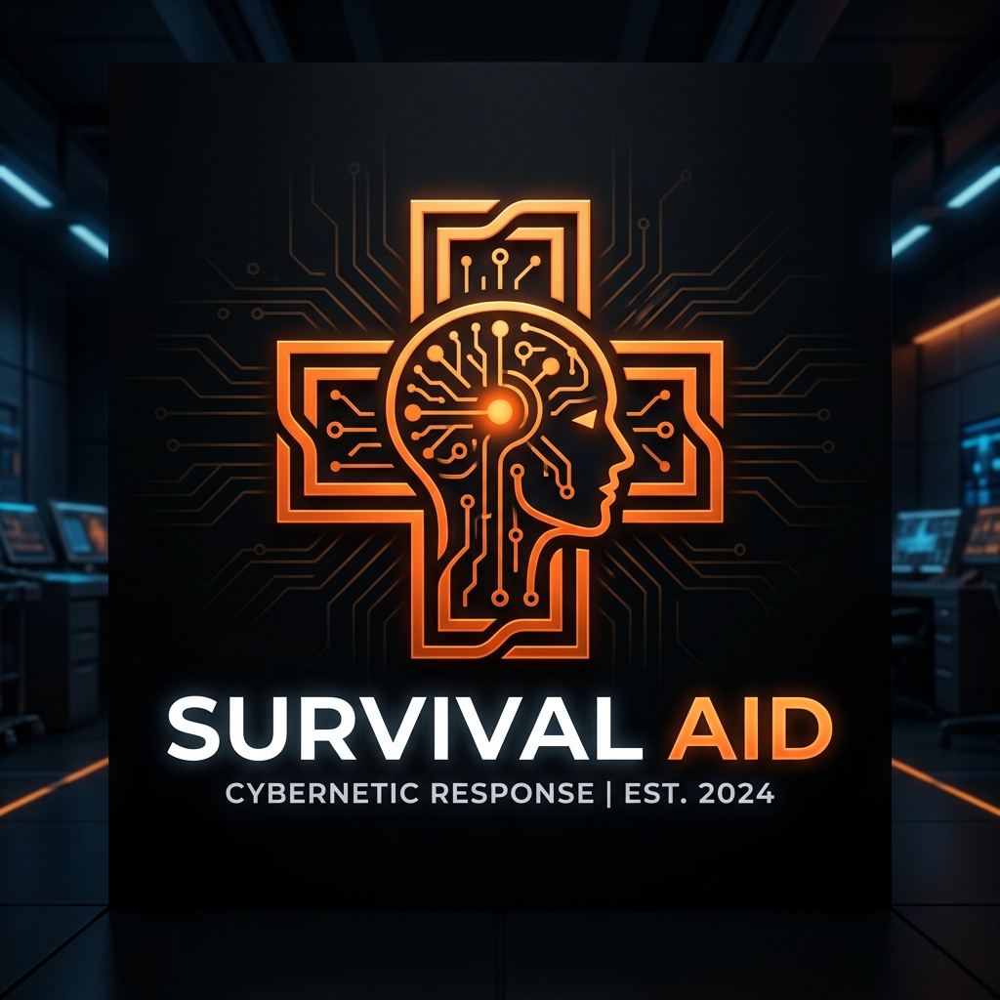
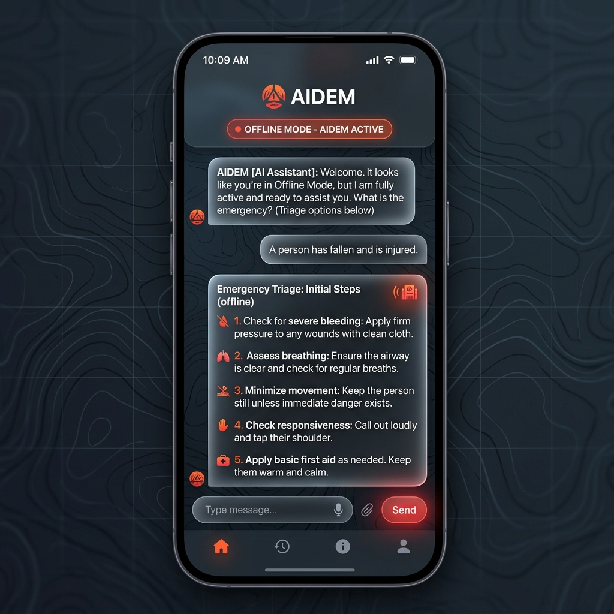
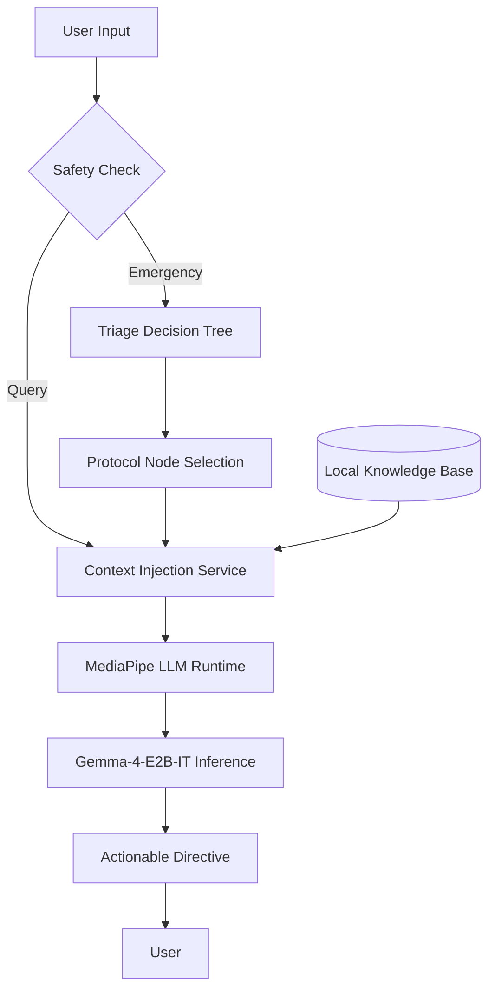

# <p align="center">AIDEM 🛡️</p>
<p align="center"><b>Artificial Intelligence Disaster & Emergency Management.</b></p>
<p align="center"><i>"Aid Them" when the grid goes down.</i></p>

<p align="center">
  
</p>

<p align="center">
  
  
  
  
</p>

---

## 🌲 The Hook

Imagine you’re miles deep in the wilderness, or in the aftermath of a major natural disaster. The grid is down, your cell signal is at zero, and someone is injured. Panic starts to set in. In that moment, you don't need a search bar—you need an expert.

**AIDEM** is a field-manual-grade expert system that lives in your pocket. Powered by Google’s **Gemma** model running entirely on-device, it provides 100% offline, context-aware assistance. It doesn't just answer questions—it leads you through them.

<p align="center">
  
</p>

## ✨ Key Features

- **🌍 Multi-Language Survival Engine**: Features a unique "Think in English, Respond in Native" workflow, allowing the AI to process medical protocols in English (for accuracy) while assisting users in Spanish, Romanian, French, and more.
- **🖼️ Multimodal First Aid**: Analyze injuries through your camera—Gemma analyzes the image and provides visual-contextual advice.
- **🛡️ 100% Offline & Private**: No data leaves your device. Perfect for remote wilderness or disaster zones where cellular networks are down.
- **🏥 The Triage Engine**: A structured, deterministic layer that guides you from initial assessment to final action, prioritizing life-saving measures (like stopping major bleeding) first.
- **📚 Expert Knowledge Base**: Protocols are sourced from the **US Army FM 21-76**, **FEMA**, **NOAA**, and **Wilderness First Aid** standards.
- **🗣️ Hands-Free Assistance**: Integrated speech-to-text and text-to-speech support for hands-on emergency scenarios.
- **📱 Cross-Platform Performance**: Built with Flutter for smooth, high-fidelity experiences on both Windows and Android.

## 🏗️ Technical Architecture: The Hybrid Expert System

AIDEM bridges the gap between creative AI reasoning and deterministic medical safety.



### Core Technology Stack
*   **Framework**: [Flutter](https://flutter.dev/)
*   **LLM Runtime**: [MediaPipe LLM Inference API](https://developers.google.com/mediapipe/solutions/genai/llm_inference)
*   **Model**: **Gemma-4-E2B-IT** (Quantized LiteRT)
*   **State Management**: [Riverpod](https://riverpod.dev/)
*   **Persistence**: Shared Preferences & Local File System

## 🚀 Getting Started

### Prerequisites
*   **Windows**: Windows 10/11 (x64)
*   **Android**: Android 12+ (SDK 31+) with high-performance NPU/GPU support recommended.
*   **Flutter SDK**: 3.19.0 or higher.

### Installation
1.  **Clone the Repository**:
    ```bash
    git clone https://github.com/CosminSh/survival-aid-offline.git
    cd survival-aid-offline/survival_aid_app
    ```
2.  **Install Dependencies**:
    ```bash
    flutter pub get
    ```
3.  **Model Setup**:
    The app will automatically prompt you to download the **Gemma-4-E2B-IT** model on first launch. 
    Alternatively, you can manually place the `.litertlm` model file in the `Assets/Models/` directory.

4.  **Run the App**:
    ```bash
    flutter run -d windows # Or your android device
    ```

## 📖 Documentation
*   [The Pitch](PITCH.md) - Why AIDEM matters.
*   [Technical Deep Dive](TECHNICAL_PRESENTATION.md) - Architecture and Edge AI details.
*   [Roadmap](TODO.md) - Current progress and future features.
*   [Gemma Hackathon Plan](Docs/GEMMA_HACKATHON_PRIZE_PLAN.md) - Prize-focused implementation plan.
*   [Kaggle Submission Draft](Docs/KAGGLE_SUBMISSION_DRAFT.md) - Writeup, demo script, and judge instructions.

## Hackathon Architecture


## Protocol Sources

| Area | Source family |
| --- | --- |
| Bleeding, choking, burns, CPR, shock | Red Cross / TCCC / AHA |
| Wilderness first aid, splinting, hypothermia, evacuation choices | Wilderness First Aid references |
| Lost-person behavior, signaling, rescue communication | NASAR / NPS |
| Disasters, shelter, radiation, wildfire, flood | FEMA / CDC / NOAA / USGS |
| Bites, ticks, poisoning, allergy, infection monitoring | CDC / WHO / Red Cross |

The runtime protocol nodes live in `survival_aid_app/assets/data/protocol.json`, and expanded retrieval text lives in `survival_aid_app/assets/data/knowledge_base.json`.

## Offline GPS Notes

AIDEM uses device GNSS through `geolocator`. A GPS fix can work without mobile data or Wi-Fi as long as the device has sky visibility and location permissions. In an active session, the location button adds the current fix to the chat, stores it in the session handoff, and includes decimal plus DMS coordinates in the rescue export.

## Local Build Commands

```bash
cd survival_aid_app
flutter pub get
flutter run -d windows
flutter run -d android
flutter build apk --release
```

For the full Gemma path, install the `.litertlm` model during first launch or place it beside the packaged app as documented by the in-app setup screen. Demo scenarios are available from the home screen and remain useful even if the model is unavailable.

## Responsible AI And Safety

AIDEM is protocol-based emergency decision support, not a clinician and not a replacement for emergency services. The app explicitly prioritizes calling emergency services first when reachable, keeps image interpretation limited, avoids diagnosing from photos alone, and preserves a local timeline for rescuers.

Known testing artifact still needed before final submission: capture an Android airplane-mode screenshot showing GPS active and the app running offline.

## ⚖️ License
Proprietary / All Rights Reserved. This source code is provided strictly for evaluation purposes as part of the **Google Gemma Hackathon**. No rights are granted for commercial or non-commercial use outside of this evaluation. See `LICENSE` for details.

---
<p align="center">
  <b>AIDEM: Stay Calm. Follow the Protocol. Aid Them.</b>
</p>
